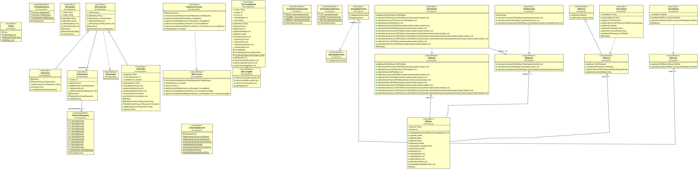

# CORREGIR- TEST

Aplicación generada para corregir de forma automática los tests generados por otra aplicación.  

## Ejecutar la aplicación

Al ejecutarse el archivo `*.jar` debe haber en la misma carpeta unicamente 3 archivos llamados igual, cada uno con las siguientes extensiones:  
- Resultado del examen `.csv`  
- Plantilla del examen `.pla`  
- alumnos del examen `.alu` (no es obligatorio)  

1.  [Archivo csv](./data/1.csv) :    
	Pueden tener hasta 11 distractores con las siguientes premisas:  
	1. El primer campo debe ser el nombre o codigo del Alumnos  
	1. Los distractores pueden ser: `a, b, c, d, e, f, g, h, i, j, k`.  
	1. las opciones deben empezar por el distractor seguido de un punto ejemplo==>  
   `a. sigo escrobiento el texto que quiera....`  
	1. Por el tipo de aplición que genera el `.csv`, que no deja desmarcar la opción una vez selecionada, una de las opciones debe ser literalmente:     
				*No_Responde.*  Puede ir seguido de texto opcional 

	1.  El nombre del archivo debe ser igual que el archivo .pla y el archivo.alu .
1. [Archivo pla](./data/1.pla) :  

	Archivo de plantilla para la corrección del test. Con las siguiente premisas:
	1. generarlo con un bloc de notas con la siguiente estructura:   `"nombre_Asignatura,numerodistractores,""opcionRespuesta"",""opcionRespuesta"",""opcionRespuesta"",""opcionRespuesta"""
			ejemplo:  "FrontendWeb,4,""b"",""c"",""a"",""d"",""d"",""a"",""c"",""b"",""c"",""b"",""b"",""b"",""c"",""a"",""d"""`    
	1. Cambio de extensión a `.pla`


[Archivo alu](./data/1.pla):  
	Es donde se encuentra el par `codigoVSalumno`, sirve por si el nombre que se pone en el examen es un  código. Para construirlo seguir las intrucciones:
	1. Si no es necesario descifrar el el nombre del alumno no es necesario generar este archivo
	2. La estructura será la siguiente:  
  ```
          "codigo";"nombre"  
          "12345e";"perico"  
          "12345p";"de los"  
          "12345l";"Palotes" 
  ``` 
  

Estando los tres archivos y *`nombreArchivo.jar`* en la misma carpeta (solo estos archivos) en una terminal se teclea `java -jar  nombreArchivo.jar`  apaerecerán en la terminal  las correcciones hechas y se generará un archivo .xlsx con las notas de cada alumno en claro.

## Datos Implementación



Proyecto [Gradle](build.gradle) en Java 8  

### Librerias Utilizadas  
- [Apache-Poi](https://poi.apache.org/) para generación `.xlsx`
- [Commo-lang3](https://commons.apache.org/) para formatear `strings`